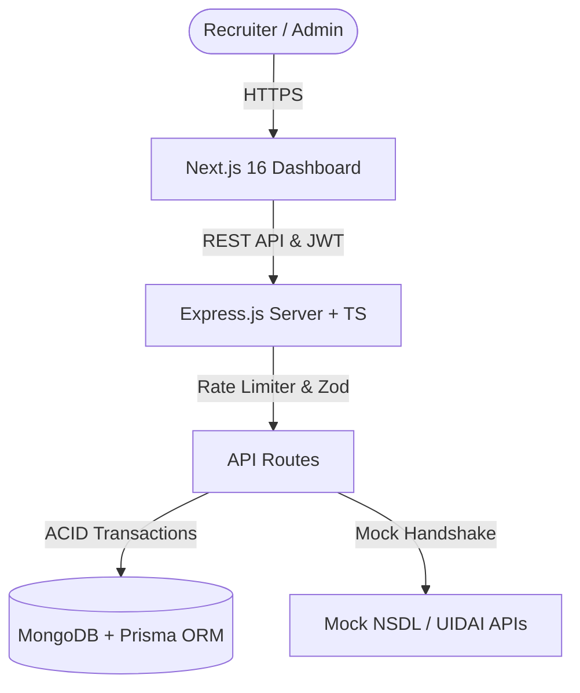

# TrustShield — Background Verification & Identity Compliance Platform

TrustShield is a highly polished, production-grade **Background Verification & Identity Compliance Platform** designed for recruiters and organizations. The platform allows recruiters to enroll candidate details, trigger identity verification workflows (Aadhaar & PAN Checks), inspect live API log responses, and download professional compliance certificates.

Inspired by premium enterprise systems like **VerifyPro**, this solution utilizes a modern, clean visual language, robust backend rate limiting, and multi-tenant isolation.

---

## 🗺️ System Architecture



---

## 🚀 Key Features

1. **VerifyPro Premium Aesthetics**:
   - Clean white card layout, thin borders, cohesive custom HSL shadows, and high contrast typography.
   - Interactive KPI metric cards (Total Candidates, Verified, Pending, Failed) featuring custom indicator circles.
   - Beautiful responsive **Recharts Area & Stacked Bar Charts** rendering real-time validation trends.
2. **Interactive Audit & Transaction Logs**:
   - Collision-safe raw JSON external API log inspector with collapsible debug terminal.
   - Custom **Verification Timeline** mapping candidates' journey from enrollment to final clearance.
   - Fully searchable verification event ledger database.
3. **Automated Verification Workflows**:
   - **Aadhaar Checks**: Verifies name, DOB, and address matching logic via Mock UIDAI endpoint.
   - **PAN Checks**: Inspects record statuses and highlights name discrepancies (Provided vs Government).
   - **Adaptive Evaluation Engine**: Automatically updates status badges to `VERIFIED`, `PARTIAL`, or `FAILED` based on individual checks.
4. **Professional Compliance Reports**:
   - Print-ready background check verification certificates with digital authorized signature panels, database seals, and verified stamps.
   - Integrated print media styles allowing recruiters to download reports directly as clean, print-friendly PDFs.
5. **Enterprise Security & Rate Limiting**:
   - Automatic masking of sensitive numbers (`XXXX-XXXX-1234` / `XXXXX1234X`).
   - Strong password hashing with `bcryptjs` and 24-hour JWT token sessions.
   - Advanced **Express Rate Limiting** preventing API abuse.

---

## 📁 Repository Structure

```text
assingmenet/                      # Workspace Root
├── backend/                      # Express & Prisma Backend Project
│   ├── prisma/                  
│   │   ├── schema.prisma         # Prisma MongoDB Schema
│   │   └── seed.ts               # Order-dependent Seeding Script
│   ├── src/                     
│   │   ├── controllers/          # Express Controllers (Auth, Candidates, Audits)
│   │   ├── middleware/           # JWT, Global Errors, Zod Validation, Rate Limiters
│   │   ├── routes/               # Express Routes (including Mock Identity APIs)
│   │   ├── services/             # Business Logic & Adaptive Verification Engine
│   │   └── app.ts                # App Entry Point
│   └── package.json             
│
├── nextjs-frontend/              # Next.js 16 Enterprise Dashboard
│   ├── app/                      
│   │   ├── dashboard/            # Layout, Candidates List, Analytics, Details View
│   │   ├── login/                # RHF + Zod Validated Login Portal
│   │   └── globals.css           # VerifyPro HSL CSS Design System & Utility Tokens
│   ├── components/               # TopBar, Sidebar, FormModal, VerificationReport
│   └── package.json             
│
├── render.yaml                   # Infrastructure-as-Code automated Render Blueprint
└── README.md                     # Primary Workspace Guide (This File)
```

---

## 🛠️ Local Installation & Setup

### Prerequisites
- **Node.js** (v18.x or higher)
- **MongoDB** (Running as a Single-Node Replica Set `rs0` for multi-document transaction support)

### Step 1: Set Up MongoDB Replica Set
Prisma's MongoDB adapter requires transactions, which are only supported on Replica Sets.

To start MongoDB locally as a replica set:
```bash
mongod --replSet rs0 --dbpath /your/db/path --port 27017
```
In a new terminal window, initialize the replica set:
```bash
mongosh --eval "rs.initiate()"
```

### Step 2: Initialize & Seed the Backend
1. Navigate to the `backend` folder:
   ```bash
   cd backend
   ```
2. Install dependencies:
   ```bash
   npm install
   ```
3. Configure your local environment file (`backend/.env`):
   ```ini
   PORT=5001
   DATABASE_URL="mongodb://127.0.0.1:27017/trustshield?replicaSet=rs0&directConnection=true"
   JWT_SECRET="super_secret_key_12345"
   ```
4. Push the schema to MongoDB:
   ```bash
   npx prisma db push
   ```
5. Seed the database with default recruiter accounts and candidate files:
   ```bash
   npm run prisma:seed
   ```
6. Start the development server:
   ```bash
   npm run dev
   ```
   *The API will be live on `http://localhost:5001/api`.*

### Step 3: Initialize the Frontend
1. Navigate to the `nextjs-frontend` folder:
   ```bash
   cd ../nextjs-frontend
   ```
2. Install dependencies:
   ```bash
   npm install
   ```
3. Configure your frontend environment (`nextjs-frontend/.env.local`):
   ```ini
   NEXT_PUBLIC_API_URL="http://localhost:5001/api"
   ```
4. Start the development server:
   ```bash
   npm run dev -- --port 3000
   ```
   *Open `http://localhost:3000` to access the dashboard.*

---

## 🔑 Demo Access Credentials
Log in using the seed recruiter account:
- **Email**: `admin@test.com`
- **Password**: `password123`
*Or click the **"Quick Fill"** button on the sign-in screen.*

---

## ⚡ API Endpoint Documentation

| Category | Method | Endpoint | Description | Rate Limited | Auth Required |
| :--- | :--- | :--- | :--- | :--- | :--- |
| **Auth** | `POST` | `/api/auth/register` | Register new recruiter account | Yes (10/hr) | No |
| **Auth** | `POST` | `/api/auth/login` | Login to receive JWT session token | Yes (15/hr) | No |
| **Candidates** | `POST` | `/api/candidates` | Create new candidate profile | No | Yes |
| **Candidates** | `GET` | `/api/candidates` | Get all candidates (Searchable & Filterable) | No | Yes |
| **Candidates** | `GET` | `/api/candidates/:id` | Get individual candidate timeline & logs | No | Yes |
| **Candidates** | `PUT` | `/api/candidates/:id` | Update candidate details | No | Yes |
| **Candidates** | `DELETE` | `/api/candidates/:id` | Delete candidate & cascade logs | No | Yes |
| **Verification**| `POST` | `/api/verifications/:id/start` | Run PAN & Aadhaar checks | Yes (30/hr) | Yes |

---

## 🚢 Production Deployment

For detailed staging deployment blueprints (Render + Vercel + MongoDB Atlas), refer to our official [Deployment Guide](file:///Users/LENOVO/.gemini/antigravity/brain/56fd2281-9f4c-48a2-a4b4-c2cfc0a82492/deployment_guide.md).
