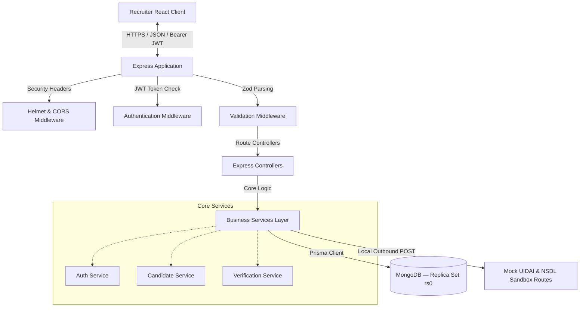
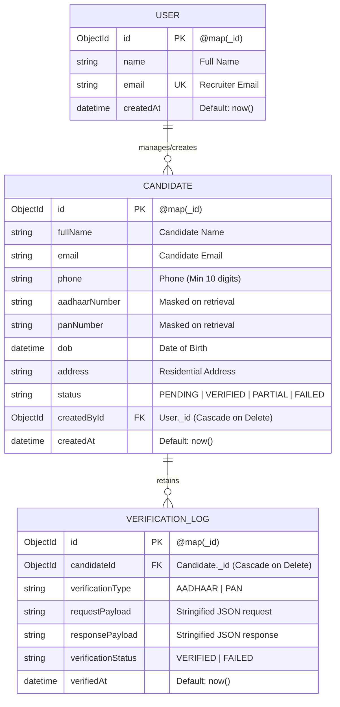
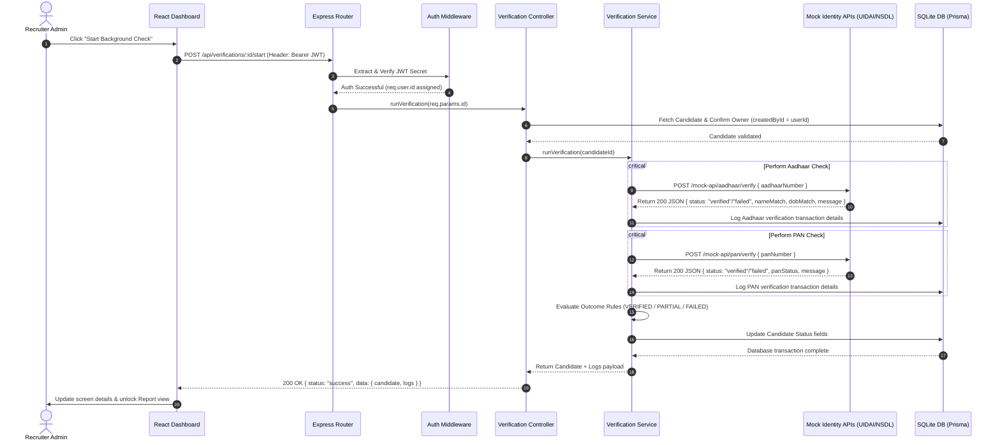

# TrustShield Backend Service — Technical Specification & API Reference

Welcome to the **TrustShield Backend Service** documentation. This service is a robust, production-ready Node.js & Express REST API written in TypeScript, using Prisma ORM for relational SQLite data persistence. It powers the candidate enrollment, multi-tenant auth borders, identity verification checks, and raw external API compliance logging.

---

## 🏗 System Architecture & Component Design

The backend is built using a highly structured, scalable **Controller-Service-Repository** pattern. This separates routing logic, strict schema validations, business workflows, database operations, and external network checks into clean, single-responsibility modules.

### High-Level Component Flow Diagram



---

## 🗃 Relational Database Design

The database layer uses **MongoDB** (accessed through Prisma ORM), running locally as a **Replica Set (`rs0`)** — required by Prisma for ACID-compliant transaction support. In production, swap `DATABASE_URL` to a **MongoDB Atlas** cluster URI for managed, globally distributed storage.

> **Why Replica Set?** Prisma's MongoDB adapter requires a replica set (even for a single-node local setup) because it uses multi-document transactions internally for safe write operations.

### Database Entity Relationship Diagram (ERD)



---

## 🔄 Verification Workflow Sequence Flow

The diagram below details the end-to-end lifecycle when a recruiter triggers a background check verification for an enrolled candidate:



---

## 📂 Project Directory Mapping

```
backend/
├── prisma/
│   ├── dev.db                  # Local SQLite Database file
│   ├── schema.prisma           # Prisma Schema (Models, Keys, Cascades)
│   └── seed.ts                 # Autopopulate Seeding Script
├── src/
│   ├── config/                 # Loaded environment keys
│   ├── controllers/            # Request orchestration (HTTP status code control)
│   │   ├── auth.controller.ts
│   │   ├── candidate.controller.ts
│   │   └── verification.controller.ts
│   ├── middleware/             # Route interceptors
│   │   ├── auth.middleware.ts  # Decodes JWT tokens, injects req.user
│   │   ├── error-handler.ts    # Centralized Express Async Error Catcher
│   │   └── validation.middleware.ts # Standard Zod parsing
│   ├── prisma/                 # Reusable db client instance
│   ├── routes/                 # Route endpoints
│   │   ├── auth.routes.ts
│   │   ├── candidate.routes.ts
│   │   ├── verification.routes.ts
│   │   ├── mock.routes.ts      # UIDAI and NSDL simulators
│   │   └── index.ts
│   ├── services/               # Workflow and DB query executions
│   ├── utils/                  # Masking utilities & custom operational errors
│   ├── validations/            # Zod validation rule structures
│   └── app.ts                  # Server start, CORS, and Helmet configuration
├── package.json
└── tsconfig.json
```

---

## 📡 Comprehensive REST API Specification

All main API endpoints are prefixed with `/api`. Sandbox Mock APIs are prefixed with `/mock-api`.

### 1. Authentication Service

#### ➜ Register Recruiter
* **Route**: `POST /api/auth/register`
* **Headers**: `Content-Type: application/json`
* **Request Body**:
```json
{
  "name": "Jane Doe",
  "email": "jane.doe@example.com",
  "password": "securepassword123"
}
```
* **Success Response (201 Created)**:
```json
{
  "status": "success",
  "message": "User registered successfully",
  "data": {
    "token": "eyJhbGciOiJIUzI1NiIsInR5cCI6IkpXVCJ9...",
    "user": {
      "id": "e2a1495c-7d52-4752-b8bb-1594e9f78322",
      "name": "Jane Doe",
      "email": "jane.doe@example.com",
      "createdAt": "2026-05-21T01:30:00.000Z"
    }
  }
}
```

#### ➜ Login Recruiter
* **Route**: `POST /api/auth/login`
* **Headers**: `Content-Type: application/json`
* **Request Body**:
```json
{
  "email": "admin@test.com",
  "password": "password123"
}
```
* **Success Response (200 OK)**:
```json
{
  "status": "success",
  "message": "Login successful",
  "data": {
    "token": "eyJhbGciOiJIUzI1NiIsInR5cCI6IkpXVCJ9...",
    "user": {
      "id": "1b5bc93c-cfce-40cf-a73c-62c114f177de",
      "name": "Recruiter Admin",
      "email": "admin@test.com",
      "createdAt": "2026-05-21T01:00:00.000Z"
    }
  }
}
```

---

### 2. Candidate Services (JWT Protected)
*Requires `Authorization: Bearer <token>` in header.*

#### ➜ Create Candidate
* **Route**: `POST /api/candidates`
* **Request Body**:
```json
{
  "fullName": "David Miller",
  "email": "david.miller@example.com",
  "phone": "9876543210",
  "aadhaarNumber": "123456789012",
  "panNumber": "ABCDE1234F",
  "dob": "1993-11-20",
  "address": "45-B Green Valley, Bangalore, Karnataka"
}
```
* **Success Response (201 Created)**:
```json
{
  "status": "success",
  "message": "Candidate created successfully",
  "data": {
    "id": "193debc6-8d1e-450f-90e9-bdfbc98c6d32",
    "fullName": "David Miller",
    "email": "david.miller@example.com",
    "phone": "9876543210",
    "aadhaarNumber": "XXXX-XXXX-9012",
    "panNumber": "XXXXX1234F",
    "dob": "1993-11-20T00:00:00.000Z",
    "address": "45-B Green Valley, Bangalore, Karnataka",
    "status": "PENDING",
    "createdById": "1b5bc93c-cfce-40cf-a73c-62c114f177de",
    "createdAt": "2026-05-21T01:31:00.000Z"
  }
}
```

#### ➜ List Candidates (With Search, Filter & Pagination)
* **Route**: `GET /api/candidates`
* **Query Parameters**:
  - `search` (Optional) - Match name, email, or PAN.
  - `status` (Optional) - Filter by `PENDING`, `VERIFIED`, `PARTIAL`, `FAILED`, or `ALL`.
  - `page` (Optional, Default: `1`) - Page number.
  - `limit` (Optional, Default: `10`) - Page size.
* **Request Example**: `GET /api/candidates?search=David&status=ALL&page=1&limit=5`
* **Success Response (200 OK)**:
```json
{
  "status": "success",
  "data": {
    "candidates": [
      {
        "id": "193debc6-8d1e-450f-90e9-bdfbc98c6d32",
        "fullName": "David Miller",
        "email": "david.miller@example.com",
        "phone": "9876543210",
        "aadhaarNumber": "XXXX-XXXX-9012",
        "panNumber": "XXXXX1234F",
        "dob": "1993-11-20T00:00:00.000Z",
        "address": "45-B Green Valley, Bangalore, Karnataka",
        "status": "PENDING",
        "createdById": "1b5bc93c-cfce-40cf-a73c-62c114f177de",
        "createdAt": "2026-05-21T01:31:00.000Z"
      }
    ],
    "pagination": {
      "total": 1,
      "page": 1,
      "limit": 5,
      "totalPages": 1
    }
  }
}
```

#### ➜ Get Candidate Profile & Logs
* **Route**: `GET /api/candidates/:id`
* **Success Response (200 OK)**:
```json
{
  "status": "success",
  "data": {
    "id": "193debc6-8d1e-450f-90e9-bdfbc98c6d32",
    "fullName": "David Miller",
    "email": "david.miller@example.com",
    "phone": "9876543210",
    "aadhaarNumber": "XXXX-XXXX-9012",
    "panNumber": "XXXXX1234F",
    "dob": "1993-11-20T00:00:00.000Z",
    "address": "45-B Green Valley, Bangalore, Karnataka",
    "status": "PENDING",
    "createdById": "1b5bc93c-cfce-40cf-a73c-62c114f177de",
    "createdAt": "2026-05-21T01:31:00.000Z",
    "verificationLogs": [],
    "createdBy": {
      "id": "1b5bc93c-cfce-40cf-a73c-62c114f177de",
      "name": "Recruiter Admin",
      "email": "admin@test.com"
    }
  }
}
```

#### ➜ Update Candidate Details
* **Route**: `PUT /api/candidates/:id`
* **Request Body**: (Allows updating details; sensitive numbers are optional)
```json
{
  "fullName": "David E. Miller",
  "phone": "9999888877"
}
```
* **Success Response (200 OK)**:
```json
{
  "status": "success",
  "message": "Candidate updated successfully",
  "data": {
    "id": "193debc6-8d1e-450f-90e9-bdfbc98c6d32",
    "fullName": "David E. Miller",
    "email": "david.miller@example.com",
    "phone": "9999888877",
    "aadhaarNumber": "XXXX-XXXX-9012",
    "panNumber": "XXXXX1234F",
    "dob": "1993-11-20T00:00:00.000Z",
    "address": "45-B Green Valley, Bangalore, Karnataka",
    "status": "PENDING",
    "createdById": "1b5bc93c-cfce-40cf-a73c-62c114f177de",
    "createdAt": "2026-05-21T01:31:00.000Z"
  }
}
```

#### ➜ Delete Candidate Record
* **Route**: `DELETE /api/candidates/:id`
* **Success Response (200 OK)**:
```json
{
  "status": "success",
  "message": "Candidate and all associated logs deleted successfully"
}
```

---

### 3. Verification Service (JWT Protected)

#### ➜ Trigger Candidate Verification Workflows
* **Route**: `POST /api/verifications/:id/start`
* **Description**: Performs simultaneous background Aadhaar and PAN check executions by querying simulation APIs, logging raw transaction logs, and updating candidate statuses.
* **Success Response (200 OK)**:
```json
{
  "status": "success",
  "message": "Verification completed",
  "data": {
    "candidate": {
      "id": "193debc6-8d1e-450f-90e9-bdfbc98c6d32",
      "fullName": "David Miller",
      "email": "david.miller@example.com",
      "phone": "9876543210",
      "aadhaarNumber": "XXXX-XXXX-9012",
      "panNumber": "XXXXX1234F",
      "dob": "1993-11-20T00:00:00.000Z",
      "address": "45-B Green Valley, Bangalore, Karnataka",
      "status": "VERIFIED",
      "createdById": "1b5bc93c-cfce-40cf-a73c-62c114f177de",
      "createdAt": "2026-05-21T01:31:00.000Z"
    },
    "logs": [
      {
        "id": "14ae4022-775b-4c54-8e10-ee6f7902dcc3",
        "candidateId": "193debc6-8d1e-450f-90e9-bdfbc98c6d32",
        "verificationType": "AADHAAR",
        "requestPayload": { "aadhaarNumber": "123456789012" },
        "responsePayload": {
          "status": "verified",
          "nameMatch": true,
          "dobMatch": true,
          "message": "Aadhaar validation successful"
        },
        "verificationStatus": "VERIFIED",
        "verifiedAt": "2026-05-21T01:33:04.221Z"
      },
      {
        "id": "0fac392c-662f-48d1-9f93-eafe78912d09",
        "candidateId": "193debc6-8d1e-450f-90e9-bdfbc98c6d32",
        "verificationType": "PAN",
        "requestPayload": { "panNumber": "ABCDE1234F" },
        "responsePayload": {
          "status": "verified",
          "panStatus": "active",
          "message": "PAN active matching records"
        },
        "verificationStatus": "VERIFIED",
        "verifiedAt": "2026-05-21T01:33:04.551Z"
      }
    ]
  }
}
```

---

### 4. Sandbox Mock Services (Unprotected, Offline Verification)

These simulate external governmental platforms (e.g. UIDAI & NSDL databases) to ensure zero-dependency offline evaluations.

#### ➜ Mock Aadhaar API Check
* **Route**: `POST /mock-api/aadhaar/verify`
* **Logic Rules**:
  - Rejects Aadhaar values starting with `"0000"` or ending with `"9999"` (simulates no record or expired).
  - Otherwise, responds as verified with active demographic matching.
* **Success Response Example (Record Match)**:
```json
{
  "status": "verified",
  "nameMatch": true,
  "dobMatch": true,
  "message": "Aadhaar validation successful"
}
```

#### ➜ Mock PAN API Check
* **Route**: `POST /mock-api/pan/verify`
* **Logic Rules**:
  - Rejects PAN values starting with `"XYZ"` or ending with `"X"` (simulates deactivated PAN card).
  - Otherwise, responds as verified with registered active status.
* **Success Response Example (Record Match)**:
```json
{
  "status": "verified",
  "panStatus": "active",
  "message": "PAN active matching records"
}
```

---

## 🛡 Security & Compliance Standard Actions

1. **Relational Constraints**: SQLite models are bound using `ON DELETE CASCADE` actions. If a recruiter deletes a candidate, all related highly sensitive credential logs (`VerificationLog`) are immediately purged from disk space, matching strict **GDPR/Right-to-be-Forgotten** parameters.
2. **Sensitive Fields Masking**: 
   A custom recursive sanitizer runs on candidate schema payloads inside response controllers. It formats Aadhaar numbers to `XXXX-XXXX-1234` and PAN numbers to `XXXXX1234X`. Raw numbers are never exposed to API readers, keeping candidate credentials safe.
3. **Password Security**: Recruiter admin credentials are encrypted using `bcryptjs` salt factors of 10.
4. **Zod Validations on Core Fields**:
   - `Aadhaar`: Exactly 12 numeric digits (`/^\d{12}$/`).
   - `PAN`: Standard format `/^[A-Z]{5}[0-9]{4}[A-Z]{1}$/` check with automated uppercase conversion.
   - `Phone`: Digit-only pattern, minimum of 10 characters.
5. **Express Security Enhancements**:
   - **Helmet**: Configures 15 standard security headers protecting from clickjacking, mime-type sniffing, XSS, and data injections.
   - **CORS Configuration**: Restricts methods to standard API calls (`GET, POST, PUT, DELETE`).
   - **Rate Limiting Protection**: Employs two distinct rate-limiters using `express-rate-limit` to secure IP endpoints (standard endpoints set to `100 requests per 15 minutes`; authentication register/login endpoints limited strictly to `15 requests per 15 minutes`).
   - **Global Async Error Wrapper**: Prevents trace disclosures or runtime leaks, hiding node package details from standard clients.
